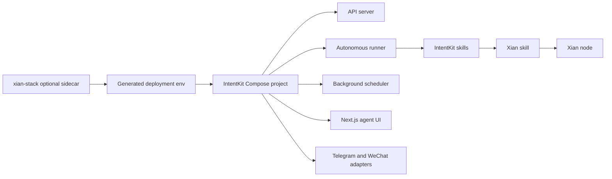

# xian-intentkit

`xian-intentkit` is a self-hosted, cloud-native team of AI agents — a fork
of upstream [IntentKit](https://intentcat.com/docs/) extended with
Xian-specific skills and stack integration. Agents collaborate, expose
external APIs and channel adapters (Telegram, WeChat), and can drive Xian
contracts through dedicated skills.

This repo is its own product and ships independently. The Xian workspace
attaches it as an optional service through `xian-stack` and `xian-cli`,
without copying the IntentKit internals into the stack repo. See
[`xian-meta/docs/INTENTKIT_STACK_INTEGRATION.md`](../xian-meta/docs/INTENTKIT_STACK_INTEGRATION.md)
for the integration contract.

## Integration Shape



## Quick Start

Local development with `uv`:

```bash
uv sync
source .venv/bin/activate
ruff format && ruff check --fix
pytest
```

Run the API server, autonomous runner, and background scheduler from `app/`.
The Next.js agent management UI lives in `frontend/`. Channel adapters
(Telegram, WeChat) live in `integrations/`.

For a stack-managed deployment alongside a Xian node:

```bash
cd ../xian-stack
python3 ./scripts/backend.py start  --intentkit
python3 ./scripts/backend.py status --intentkit
python3 ./scripts/backend.py stop   --intentkit
```

`xian-stack` runs IntentKit as a separate Compose project with a thin
stack-owned override file, and generates
`xian-intentkit/deployment/.env` from `xian-intentkit/.env.example`, the
operator env, and stack-derived Xian values. The IntentKit Compose file
itself is unchanged.

For full end-user documentation, see
[https://intentcat.com/docs/](https://intentcat.com/docs/).

## Principles

- **Cloud-native, multi-agent.** IntentKit manages a collaborative team of
  agents that can call each other, with the API server, autonomous runner,
  and background scheduler all running in one cluster.
- **Secure by design.** Agents cannot access operator secrets directly;
  skills and clients mediate every external call.
- **Extensible skill system.** Skills are LangChain `BaseTool`
  implementations under `intentkit/skills/`, including a dedicated `xian/`
  skill for on-chain reads and writes.
- **Independent of `xian-stack`.** The repo owns its Compose topology, app
  env contract, backend, frontend, and channel services. `xian-stack`
  attaches it without copying internals.
- **No ForeignKey constraints.** All tables intentionally omit FK
  constraints. Do not add them.
- **Pydantic V2 / SQLAlchemy 2.0 only.** Do not use legacy V1 / 1.x APIs.
- **Strict import order.**
  `utils → config → models → abstracts → clients → skills → core`. A
  module on the left cannot import a module on the right.
- **AgentCore ↔ Template sync.** `AgentCore` (Pydantic) is the shared base
  for both `Agent` and `Template`. Adding or removing fields in
  `AgentCore` requires matching column changes in `TemplateTable`
  (`intentkit/models/template.py`); the Pydantic model inherits but the
  DB schema does not. Agent-specific fields belong in `AgentUserInput`,
  not `AgentCore`.

## Key Directories

- `intentkit/` — pip-installable package:
  - `core/` — agent system (LangGraph), with `manager/` for the single-agent
    manager and `system_skills/` for built-in system skills.
  - `models/` — paired Pydantic and SQLAlchemy models.
  - `config/` — system config (DB, LLM keys, skill provider keys).
  - `skills/` — LangChain `BaseTool` skill implementations, including
    `xian/`, `aave_v3/`, `cdp/`, `dexscreener/`, `dune/`, etc.
  - `abstracts/` — interfaces between `core/` and `skills/`.
  - `clients/` — external service clients.
  - `utils/` — shared utilities.
- `app/` — API server, autonomous runner, and background scheduler.
- `frontend/` — Next.js agent management UI (see
  [frontend/AGENTS.md](frontend/AGENTS.md)).
- `integrations/` — Go channel adapters
  ([integrations/AGENTS.md](integrations/AGENTS.md)) including
  `telegram/` and `wechat/`.
- `deployment/` — Compose project, env scaffolding, and operator-facing
  deployment docs.
- `scripts/` — ops and migration scripts.
- `agent_docs/` — detailed contributor guides (`skill_development.md`,
  `ops_guide.md`, `test.md`).
- `tests/` — `tests/core/`, `tests/api/`, `tests/skills/`.
- `docs/` — Hugo-based public documentation (also published at
  intentcat.com/docs).

## Validation

```bash
source .venv/bin/activate
ruff format
ruff check --fix
basedpyright           # type check
pytest                 # full suite
```

After adding a feature, add tests. After modifying an existing feature,
check whether existing tests need updates and make sure the suite still
passes.

## Related Docs

- [AGENTS.md](AGENTS.md) — repo-specific guidance for AI agents and contributors
- [CLAUDE.md](CLAUDE.md) — LLM-facing architecture and rules summary
- [DEVELOPMENT.md](DEVELOPMENT.md) — local development setup
- [CONTRIBUTING.md](CONTRIBUTING.md) — contribution rules
- [agent_docs/skill_development.md](agent_docs/skill_development.md) — adding new skills
- [agent_docs/ops_guide.md](agent_docs/ops_guide.md) — git, PR, and release process
- [agent_docs/test.md](agent_docs/test.md) — testing guide
- [`xian-meta/docs/INTENTKIT_STACK_INTEGRATION.md`](../xian-meta/docs/INTENTKIT_STACK_INTEGRATION.md) — Xian stack integration contract
- [Public documentation](https://intentcat.com/docs/)
